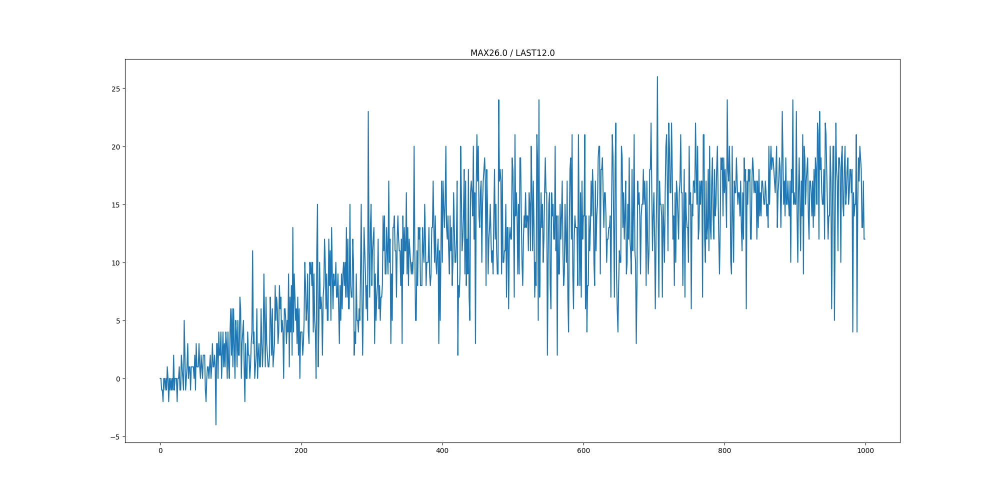

I reached score of ~16 at Banana Collectors task within 1000 episodes thus solved the problem, using Dueling Double Deep Q-Leaning. 

## Learning Algorithm

I used Deep Q-Learning algorithm(https://arxiv.org/pdf/1312.5602.pdf).

For Q-network, I used Dueling Architecture(https://arxiv.org/pdf/1511.06581.pdf).

For calculating target, I used Double Q-Learning(https://arxiv.org/pdf/1509.06461.pdf).

### Hyperparameters
* lr: 5e-4 (learning rate for updating local q-network)
* gamma: 0.9 (discount factor when calculating return)
* tau: 1e-3 (learning rate for updating target q-network)
* update_freq: 4 (update local/target q-network every ~ steps)
* buffer_size: 1e5 (maximum number of experiences to save in replay buffer)
* batch_size: 64 (number of experiences to do one step of update)
* n_episodes: 1000 (total number of episodes to play)
* max_t: 1000 (maximum steps to take in single episode)
* eps: 1 (starting epsilon for epsilon-greedy)
* eps_end: 0.01 (minimum value for epsilon)
* eps_decay: 0.995 (decay rate per step for epsilon)

## Plot of Scores While Training
This plot shows average scores in past 100 episodes per episode. (x-axis: episode #, y-axis: score)

## Ideas for Future Work
* Tune hyperparameters
* Try rainbow algorithm(https://arxiv.org/pdf/1710.02298.pdf)
* Use pixel input
